# Loan App

A loan management app designed to help users track loan details, view payment schedules, and manage their finances with ease.

## Getting Started

This project serves as a foundation for a Flutter application focused on loan tracking and management.

### Features

- View and manage loan details
- Track repayment schedules and progress
- Receive reminders for upcoming payments
- Simple and user-friendly interface for efficient navigation

### Screenshots
*Note: Screenshots are provided below for reference. Ensure these images are optimized for quick loading.*

    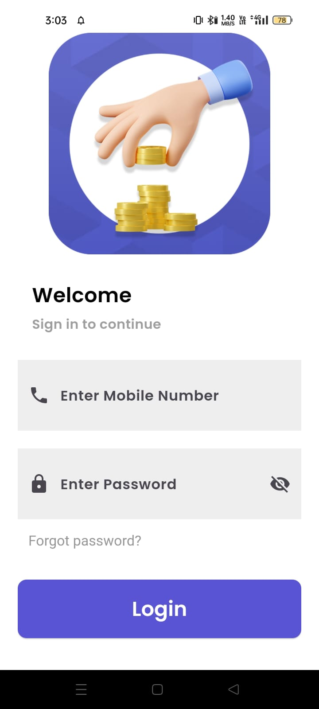
    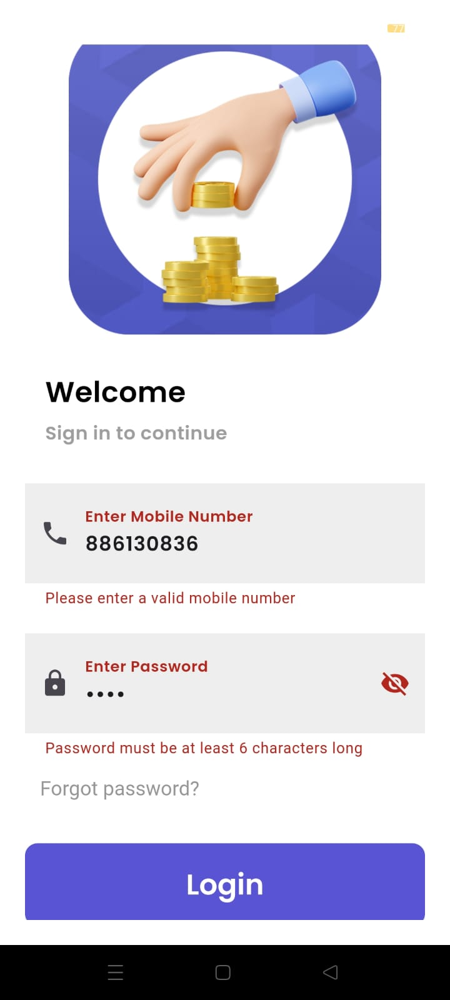
    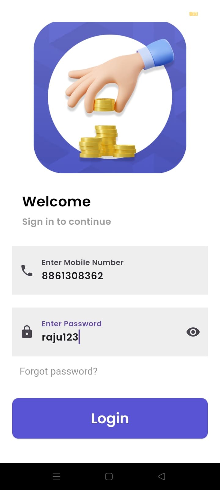
    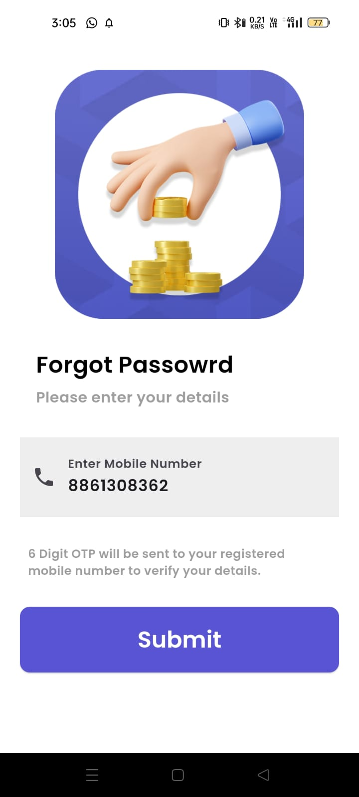
    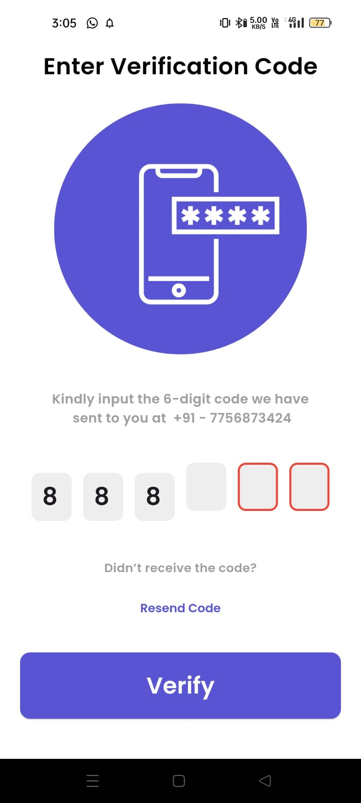
    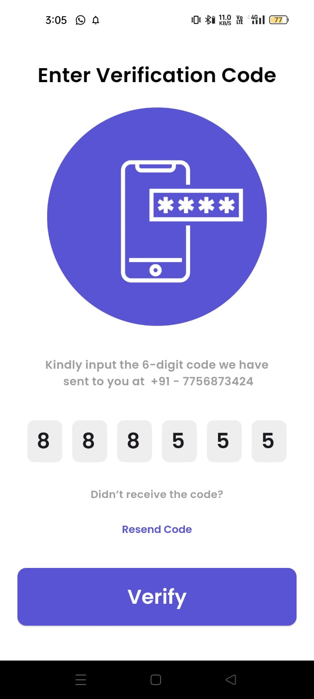
    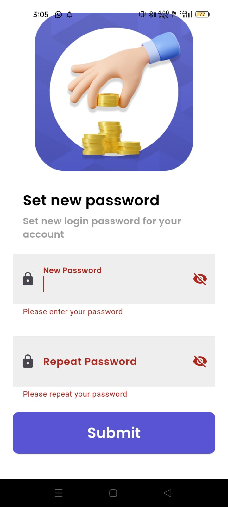
    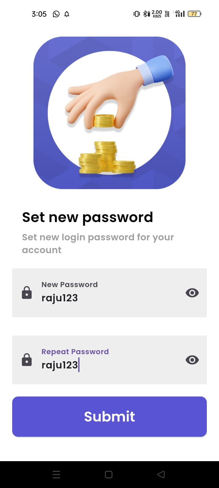
    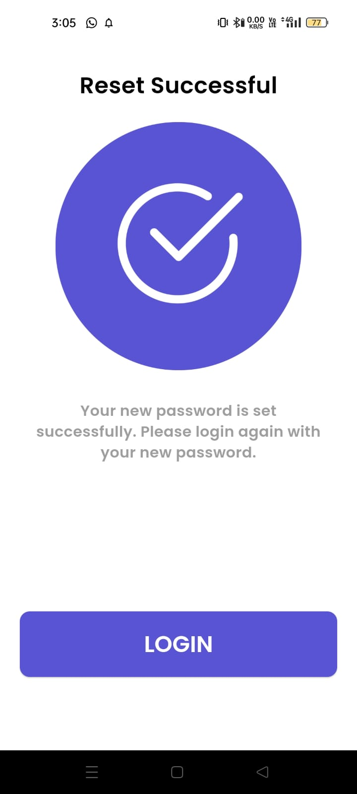
    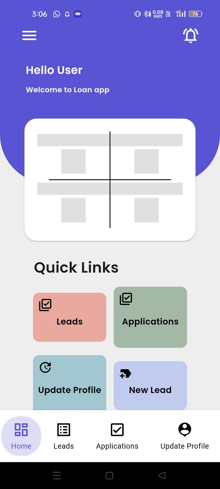
    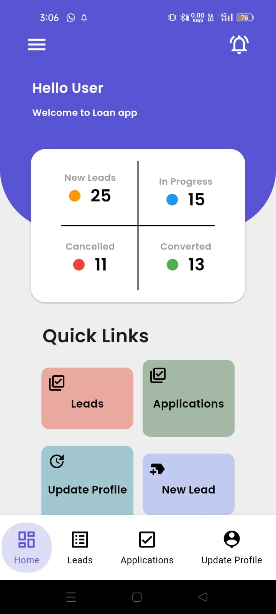
    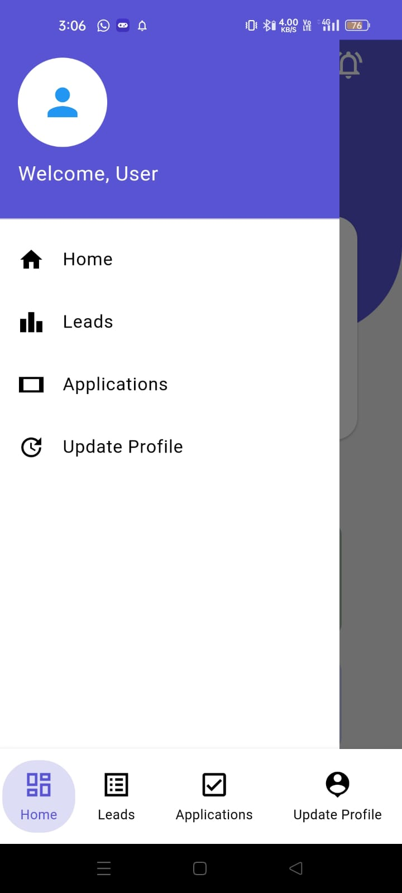
    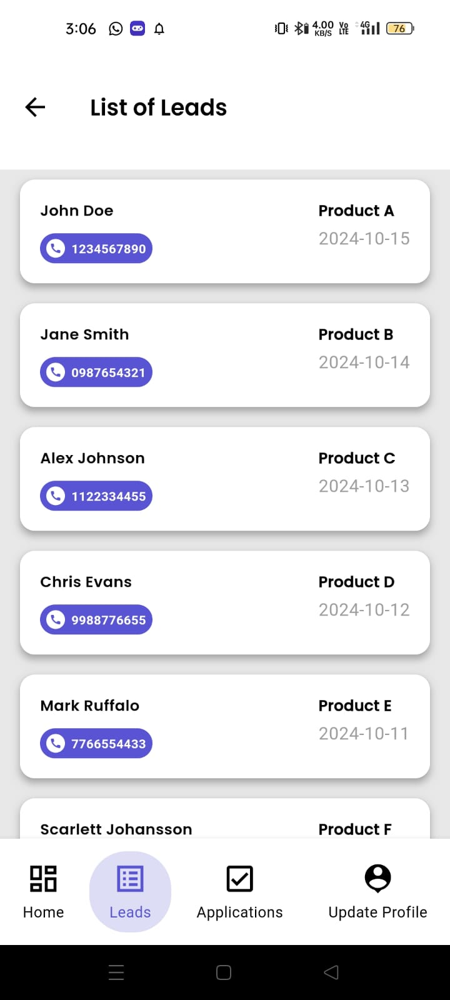
    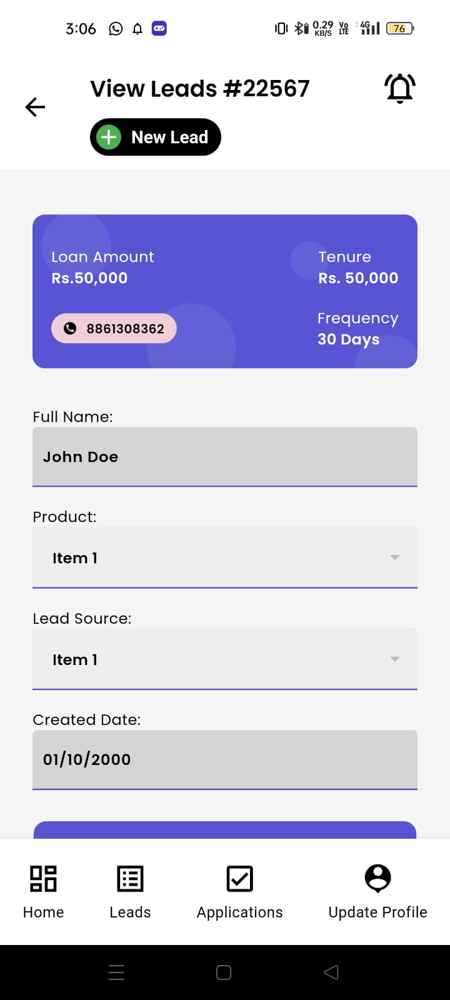
    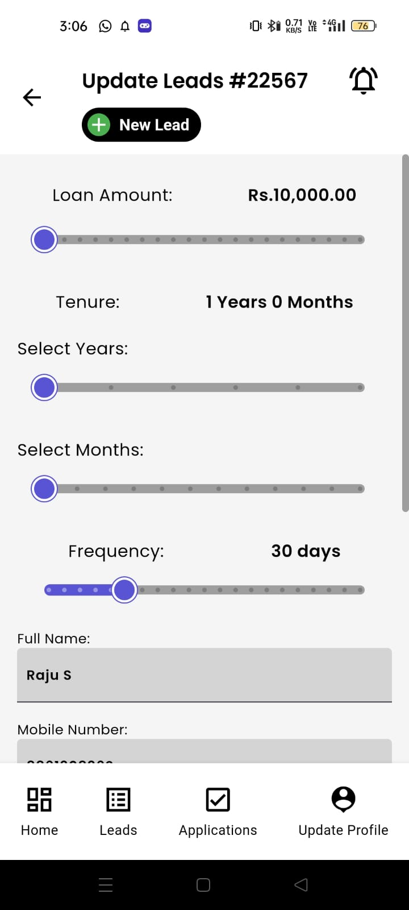
    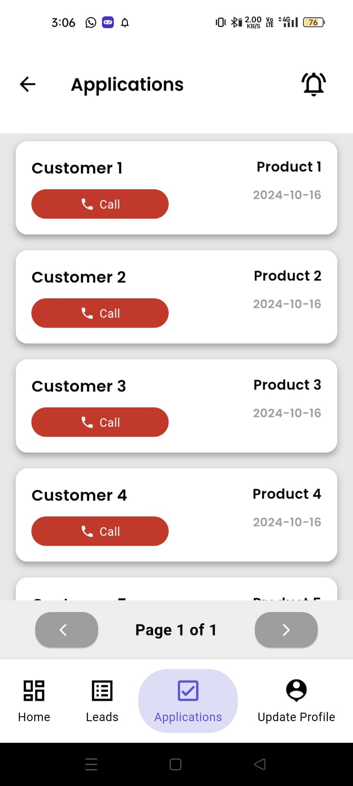
    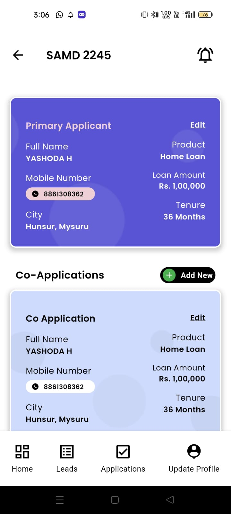

